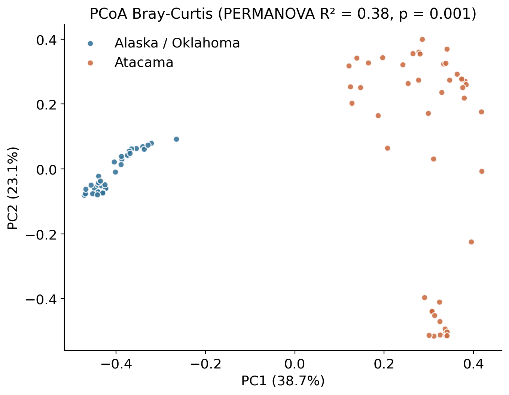
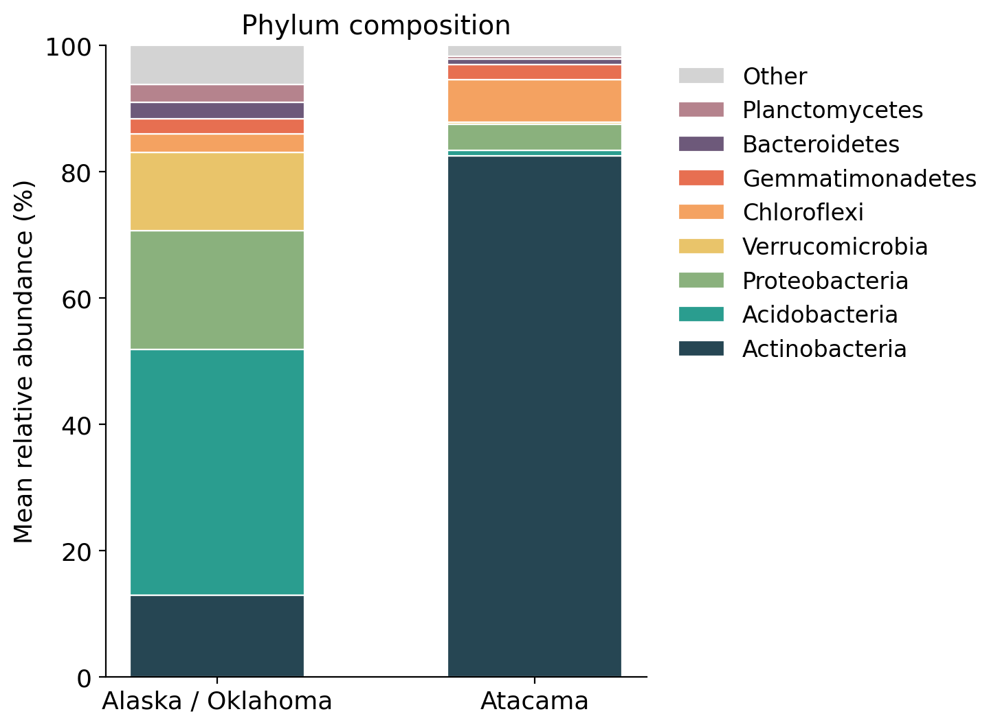

# Soil microbiome: desert vs vegetated soils

This project compares the soil bacteria of the Atacama Desert with those of an Alaskan tundra and an Oklahoma prairie. It reuses public data from two published studies and processes both with the same Python script.

**Question:** Which does more to shape a soil bacterial community, low
temperature or lack of water?

The Alaskan tundra and the Oklahoma prairie are both vegetated but differ in
climate, so comparing them isolates a temperature contrast. The Atacama is warm
but hyper-arid, so comparing it to the vegetated soils isolates a water contrast.
Putting both on the same diversity and ordination axes shows which of the two
separates communities further.

## Data

| | Study A | Study B |
| --- | --- | --- |
| MGnify accession | [MGYS00002018](https://www.ebi.ac.uk/metagenomics/studies/MGYS00002018) | [MGYS00000770](https://www.ebi.ac.uk/metagenomics/studies/MGYS00000770) |
| Soils | Alaskan tundra and Oklahoma prairie | Atacama Desert, six sites along a moisture gradient |
| Publication | Johnston et al., 2016, *Frontiers in Microbiology* | Crits-Christoph et al., 2013, *Microbiome* |
| 16S region | V4, Illumina | V1 to V3, 454 pyrosequencing |
| MGnify pipeline | v4.0 | v5.0 |

The two files in `data/` are the `taxonomy_abundances_SSU` tables downloaded from the MGnify FTP server:

- Study A: https://ftp.ebi.ac.uk/pub/databases/metagenomics/mgnify_results/ERP012/ERP012016/version_4.0/project-summary/taxonomy_abundances_SSU_v4.0.tsv
- Study B: https://ftp.ebi.ac.uk/pub/databases/metagenomics/mgnify_results/SRP026/SRP026010/version_5.0/project-summary/taxonomy_abundances_SSU_v5.0.tsv

## What the script does

1. **Clean.** Removes 10 assembly entries (ERZ columns with only 1 or 2 reads each) and 19 Atacama samples with fewer than 1,000 reads.
2. **Harmonize.** Keeps Bacteria and Archaea only and cuts every lineage at family level. Pipeline v4.0 often names species while v5.0 mostly stops at family, so this puts both tables on the same footing.
3. **Rarefy.** Subsamples every sample to 1,000 reads. Study A has about 72,000 reads per sample and study B about 2,600, so without this the deeper samples would look richer.
4. **Analyse.** Observed richness, Shannon and Simpson indices, Bray-Curtis dissimilarity with a PCoA, PERMANOVA, and Mann-Whitney tests with Benjamini-Hochberg correction.

85 samples remain after cleaning: 36 from study A and 49 from study B.

## Main results

| | Alaska / Oklahoma | Atacama |
| --- | --- | --- |
| Taxa per 1,000 reads (median) | 92.5 | 34 |
| Shannon index (median) | 3.23 | 1.83 |
| Actinobacteria | 12.8% | 82.5% |
| Acidobacteria | 38.9% | 0.8% |

- Desert samples are far less diverse (Mann-Whitney p = 1.2 × 10⁻¹⁰ for Shannon).
- The two groups do not overlap on the PCoA (PERMANOVA R² = 0.38, p = 0.001). Mean Bray-Curtis dissimilarity between groups is 0.93.
- The most different pair of samples inside study A has a Bray-Curtis of 0.77, while a typical desert-versus-vegetated pair reaches 0.96. The data support the idea that dryness changes soil bacteria more than the tundra/prairie contrast does.
- The dominant groups match those reported in both original papers.




## Limitations

The two studies used different primers, sequencing platforms, years and MGnify pipeline versions, so part of the difference between them may be technical. Harmonization and rarefaction reduce this but cannot remove it. Alaska and Oklahoma samples were not separated, and the study A table has 36 runs for 19 soils, so some soils may be counted twice. Results are at family level and in relative abundance only.

## How to run it

You need Python 3 and four libraries:

```
pip install -r requirements.txt
python compare_studies.py
```

On Windows, use `py -3 compare_studies.py`. The script reads `data/` and writes 7 figures to `results/figures/` and 6 tables to `results/tables/`. A fixed random seed makes every run give the same numbers.

```
├── compare_studies.py
├── data/
│   ├── study_A_alaska_oklahoma.tsv
│   └── study_B_atacama.tsv
├── results/
│   ├── figures/
│   └── tables/
├── requirements.txt
└── LICENSE
```

## How this project was made

This was a course project at the Euro-Mediterranean University of Fez (UEMF).

I chose the datasets and the research question, ran the analysis on my own computer, checked the results against the two original papers, and interpreted them. The Python code was written with the help of Claude, an AI assistant made by Anthropic, and I reviewed and tested it.

## Limitations

The two datasets come from separate studies. MGYS00002018 and MGYS00000770 used
different DNA extraction protocols, primer pairs, sequencing runs and sequencing
depths, and each of those differences shifts diversity indices and community
distances. The difference in Shannon diversity is therefore confounded by technical
variation and cannot be attributed to soil type or aridity alone.

The PCoA has the same problem. Samples separate primarily by study of origin, which
is expected from two independently generated datasets whatever the underlying
ecology, so that separation is not a biological result.

Shannon and Simpson were computed on MGnify's precomputed taxonomy_abundances tables
with no rarefaction. Alpha diversity is sensitive to sequencing depth, so unequal
depth between the two studies inflates the apparent difference.

Sample numbers are unbalanced (46 versus 68), and samples within a single study are
not independent replicates. Treating them as independent inflates statistical
significance.

The abundances are MGnify pipeline outputs at assigned taxonomic ranks rather than
ASVs generated by one consistent workflow.

A design that avoids most of this: compare soil types sampled at the same site and
sequenced in the same run, within a single study. Failing that, apply batch
correction across studies.

## References

- Johnston ER, Rodriguez-R LM, Luo C, et al. (2016). Metagenomics reveals pervasive bacterial populations and reduced community diversity across the Alaska tundra ecosystem. *Frontiers in Microbiology* 7:579. https://doi.org/10.3389/fmicb.2016.00579
- Crits-Christoph A, Robinson CK, Barnum T, et al. (2013). Colonization patterns of soil microbial communities in the Atacama Desert. *Microbiome* 1:28. https://doi.org/10.1186/2049-2618-1-28
- Richardson L, Allen B, Baldi G, et al. (2023). MGnify: the microbiome sequence data analysis resource in 2023. *Nucleic Acids Research*. https://doi.org/10.1093/nar/gkac1080

## Author

Sihame Khalifi, 5th-year Biotechnology Engineering student, UEMF.

The code is under the MIT license. The data belong to the original studies and are shared by MGnify.
